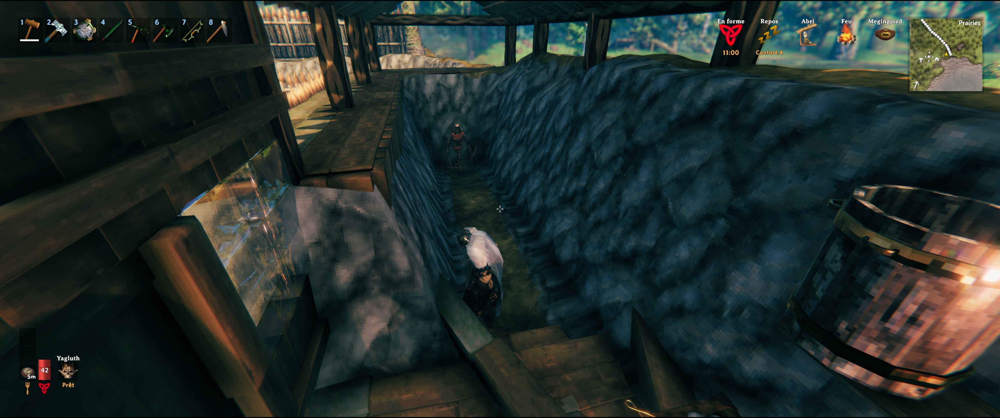
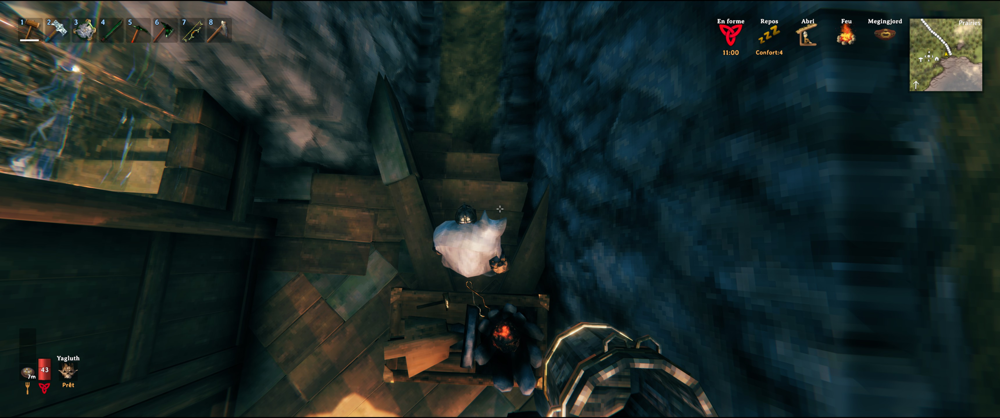

# ⚔️ Valheim Automation Tools

Script Python d'automatisation des tâches répétitives pour **Valheim**.

---

## 📌 Fonctionnalités

- 🗡️ **XP des armes :** Entraînement automatique face à un mannequin d'entraînement.
- 🌱 **Jardinage automatique :** Plantation et récolte des cultures.

---

## 🛠️ Prérequis & Dépendances

### 1. Outils système & Python
#### Linux (Testé sous Mint)
- **`xdotool`** : Gestion des interactions système sous Linux.
  ```bash
  sudo apt install xdotool
  ```
- Module python **`pynput`** : Emission d'événements clavier/souris (géré par uv).
#### Windows
- Module python **`pynput`** : Emission des événements clavier/souris (géré par uv).
- Module python **`pydirectinput`** : Emission des événements souris (géré par uv).

### 2. Gestionnaire de projet (`uv`)
Ce projet utilise **`uv`** pour la gestion de l'environnement virtuel et des dépendances.
- Pour installer `uv`, consultez la [Documentation officielle d'installation](https://docs.astral.sh/uv/getting-started/installation/).

---

## 🚀 Lancement de l'automate

Utilisez les scripts fournis à la racine du projet selon votre système d'exploitation :

- **Sous Linux :**
  ```bash
  ./start.sh
  ```
- **Sous Windows :**
  ```cmd
  start.cmd
  ```

*Alternativement, vous pouvez lancer le script directement via `uv` :*
```bash
uv run main.py
```

---

## ⚙️ Configuration & Réglages

> ⚠️ **Disposition du clavier :** Le script est préréglé pour un clavier **AZERTY**. Si vous utilisez une autre disposition (QWERTY, etc.), modifiez les constantes situées en haut du script.

### 🔑 Constantes Clavier (AZERTY)

```python
TOUCHE_UTILISER           = "e"
TOUCHE_AVANCER            = "z"
TOUCHE_RECULER            = "s"
TOUCHE_MARCHER_LENTEMENT  = "c"
TOUCHE_ITEM_1             = "&"
TOUCHE_ITEM_2             = "é"
TOUCHE_ITEM_3             = '"'
TOUCHE_ITEM_4             = "'"
TOUCHE_ITEM_5             = "("
TOUCHE_ITEM_6             = "-"
TOUCHE_ITEM_7             = "è"
TOUCHE_ITEM_8             = "_"
TOUCHE_ULTI               = "f"
```

---

## ⛏️ Mise en place du terrain
- Préparez un couloir d'environ 12m de long en terre (à l'aide de la houe) pour monter des murs indestructibles.
- Fermez une extrémité du couloir avec un mur en terre.
- Mettez un mannequin face au couloir et dos à ce mur.

- Du côté ouvert, faites un entonnoire avec 2 ou 3 poutres de bois et placez une forge (ou autre établi permettant de réparer vos armes).


## 🎯 Premier Lancement (Calibrage)

Avant d'utiliser les automates, vous devez calibrer le déplacement de la souris et les coordonnées du bouton réparer de la forge en modifiant les variables en haut du script :

1. **Demi-tour horizontal :**  
   Ajustez `NOMBRE_PIXEL_DEMI_TOUR_HORIZONTAL`  
   *Test :* Appuyez 2 fois sur <kbd>F6</kbd> (2 demi-tours). Le curseur doit revenir exactement à son point d'origine.

2. **Ajustement vertical :**  
   Ajustez `NOMBRE_PIXEL_QUART_TOUR_VERTICAL`  
   *Test :* Appuyez sur <kbd>F10</kbd>. Le regard de votre personnage doit passer de l'horizon à ses pieds (approcximativement).

3. **Bouton de réparation :**  
   Ajustez `POS_BTN_REPARER_X` et `POS_BTN_REPARER_Y`  
   *Test :* Placez-vous sur une forge et appuyez sur <kbd>F11</kbd>. Le curseur doit se positionner précisément sur le bouton **Réparer**.

---

## 📖 Modes d'Utilisation

### 🗡️ Mode Farming des Armes
#### Préparation de l'inventaire :
- Placez vos **armes** dans les slots **`3`** et **`4`**.
  - *Arme à une main :* Mettez une seule arme en `3` ou `4` et laissez l'autre slot vide.
- Placez la **nourriture** dans les slots **`7`** et **`8`** (ex: Miel, Viande de sanglier).
  - *Sans nourriture :* Laissez les slots `7` et `8` vides.
- **Équipement recommandé :** Broche de fer + nourriture.

#### Positionnement :
1. Placez-vous dans le cadre de farm face au mannequin d'entraînement.
2. Visez le sol juste devant vous.
3. Appuyez sur <kbd>F6</kbd> pour faire un demi-tour : la forge doit être visée (le message *"Utiliser la forge"* doit apparaître).
4. Appuyez de nouveau sur <kbd>F6</kbd> pour vous retourner face au mannequin.
5. Équipez vos armes (slots `3` et `4`) et démarrez l'automate.

---

### 🌱 Mode Farming du Jardin

#### Préparation :
1. Équipez-vous du **Cultivateur** (et sélectionnez le type de culture via le clic droit) ou de la **Faux**.
2. Utilisez les touches de raccourci <kbd>F3</kbd> et <kbd>F4</kbd> pour régler :
   - Le nombre d'actions par rangée.
   - Le nombre total d'actions.
3. Positionnez-vous au début de la rangée, visez approximativement la fin de la première rangée.
4. Pour planter, appuyez sur <kbd>F10</kbd> afin que le personnage regarde à ses pieds.

---

## ⌨️ Commandes

| Touche | Action | Description |
| :---: | :--- | :--- |
| <kbd>F8</kbd> | **Démarrer / Arrêter** | Active ou désactive l'automatisation en cours. |
| <kbd>F7</kbd> | **Changer d'automate** | Bascule entre le mode Armes et le mode Jardin. |
| <kbd>F3</kbd> | **Réglage Jardin** | Modifie le nombre d'actions par rangée. |
| <kbd>F4</kbd> | **Réglage Jardin** | Modifie le nombre total d'actions. |
| <kbd>F6</kbd> | **Test Demi-tour** | Effectue un demi-tour à 180° (pour tester la calibration). |
| <kbd>F10</kbd> | **Test Regard** | Alterne le regard entre l'horizon et les pieds (pour tester la calibration). |
| <kbd>F11</kbd> | **Test Réparation** | Déplace la souris sur le bouton Réparer de la forge (pour tester la calibration). |

---

# **Avancé**

# Guide d'utilisation et d'extension des Automates Valheim

Ce document explique comment les suites d'action sont enregistrées dans le script python et la méthode pas à pas pour en ajouter de nouvelles.

---

## 1. Comment sont enregistrées les suites d'action

Les suites d'action sont structurées sous forme d'**automates** grâce à la classe `Automate`. Chaque automate prend un nom et trois listes de fonctions exécutées séquentiellement (généralement définies via des expressions `lambda`) :

* **`actions_pre`** : Actions d'initialisation exécutées **une seule fois** au lancement de l'automate.
* **`actions_loop`** : Actions exécutées **en boucle principale** tant que l'automate est actif.
* **`actions_post`** : Actions de nettoyage exécutées **une seule fois** à l'arrêt de l'automate.

Dans le code, l'enregistrement se fait au niveau de la méthode `__build_automates()` au sein de la classe `Program` :

```python
Automate("Nom_De_L_Automate",
    [ # Actions PRE (Ex: préparation, nourriture, posture initiales)
        lambda: self.actions.manger(),
    ],
    [ # Actions LOOP (Ex: cycle principal d'attaque, récolte, réparation)
        lambda: self.actions.attaquer(2),
        # L'action "reparer" est effectué une fois toutes les 5 boucles
        lambda: self.looper_controler.action_toutes_les_n_boucles(5, action=self.actions.reparer),
    ],
    [ # Actions POST (Ex: recul de sécurité, déséquipement)
        lambda: self.actions.reculer(4),
    ]
)
```

---

## 2. Comment ajouter une nouvelle suite d'actions

Pour ajouter une nouvelle routine automatisée (par exemple pour la pêche, le minage ou l'artisanat), suivez ces 3 étapes :

### Étape 1 : (Optionnel) Définir de nouvelles actions de base
Si votre routine nécessite une action non encore couverte par le script, ajoutez une méthode dédiée dans la classe `Actions`.

*Exemple :*
```python
def pecher(self):
    # Maintenir le clic gauche pendant 1 secondes pour lancer la ligne
    self.inputs.cliquer(1.0)

def equiper_canne(self):
    # On équipe le premier item
    self.inputs.clavier_appuie(self.touche_item_1)

def ramener_canne(self):
    # Maintenir le clic droit pendant 5 secondes pour lancer la ligne
    self.inputs.souris_clic_droit(5)
```

### Étape 2 : Déclarer le nouvel automate
Ajoutez une nouvelle instance d' `Automate` dans la liste retournée par `__build_automates()` dans la classe `Program`.

*Exemple :*
```python
def __build_automates(self):
    return [
        # ... Automates existants (Armes, Jardin - Plantation, Jardin - Recolte) ... ,
        
        Automate("Peche",
            [ # Pre: Équiper la canne à pêche (objet en slot 1)
                lambda: self.actions.equiper_canne(),
            ],
            [ # Loop: Lancer la ligne et attendre
                # Lancer la canne
                lambda: self.actions.pecher(),
                # Attendre 10 secondes qu'un poisson arrive
                lambda: self.time.attendre(10),
                # Rammerner la canne (avec un poisson si vous avez de la chance)
                lambda: self.actions.ramener_canne(),
                # Attendre 10 secondes pour récupérer l'endurance
                lambda: self.time.attendre(10),
            ],
            [ # Post: Pause de fin de séquence
                lambda: self.actions.attendre(1),
            ]
        )
    ]
```

### Étape 3 : Exécuter et tester en jeu
1. Lancez le script Python (`python automate_valheim.py`).
2. Appuyez sur **F7** dans le jeu pour faire défiler les modes jusqu'à sélectionner votre nouvel automate (`[+] Changement de mode : Peche`).
3. Appuyez sur **F8** pour **Démarrer / Arrêter** la boucle d'actions.